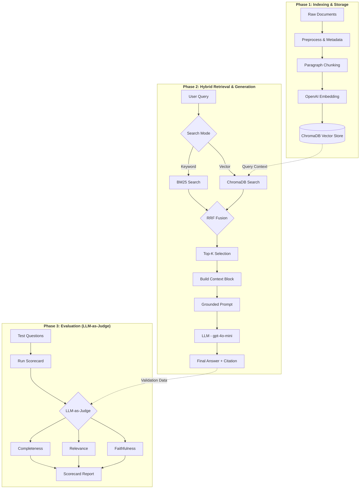

# Architecture — RAG Pipeline (Day 08 Lab)

> Template: Điền vào các mục này khi hoàn thành từng sprint.
> Deliverable của Documentation Owner.

## 1. Tổng quan kiến trúc

```
[Raw Docs]
    ↓
[index.py: Preprocess → Chunk → Embed → Store]
    ↓
[ChromaDB Vector Store]
    ↓
[rag_answer.py: Query → Retrieve → Rerank → Generate]
    ↓
[Grounded Answer + Citation]
```

**Mô tả ngắn gọn:**
Hệ thống là một Full RAG Pipeline hỗ trợ IT Helpdesk và CS phản hồi các câu hỏi về chính sách nội bộ (quy trình cấp quyền, SLA ticket, hoàn tiền). Hệ thống sử dụng Hybrid Retrieval (Dense + BM25) để đảm bảo độ chính xác cao cho cả các truy vấn ngữ nghĩa và các thuật ngữ chuyên môn (keyword).

---

## 2. Indexing Pipeline (Sprint 1)

### Tài liệu được index
| File | Nguồn | Department | Số chunk |
|------|-------|-----------|---------|
| `policy_refund_v4.txt` | policy/refund-v4.pdf | CS | 6 |
| `sla_p1_2026.txt` | support/sla-p1-2026.pdf | IT | 5 |
| `access_control_sop.txt` | it/access-control-sop.md | IT Security | 7 |
| `it_helpdesk_faq.txt` | support/helpdesk-faq.md | IT | 6 |
| `hr_leave_policy.txt` | hr/leave-policy-2026.pdf | HR | 5 |

### Quyết định chunking
| Tham số | Giá trị | Lý do |
|---------|---------|-------|
| Chunk size | 400 tokens | Tương đương ~400 tokens, sweet spot cho policy documents. |
| Overlap | 80 tokens | Đảm bảo context không bị mất giữa các paragraph. |
| Chunking strategy | Paragraph-based | Tránh cắt giữa câu, giữ nguyên vẹn ý nghĩa từng đoạn. |
| Metadata fields | source, section, effective_date, department, access | Phục vụ filter, freshness, citation và tracking nguồn gốc. |

### Embedding model
- **Model**: OpenAI text-embedding-3-small
- **Vector store**: ChromaDB (PersistentClient)
- **Similarity metric**: Cosine

---

## 3. Retrieval Pipeline (Sprint 2 + 3)

### Baseline (Sprint 2)
| Tham số | Giá trị |
|---------|---------|
| Strategy | Dense (embedding similarity) |
| Top-k search | 10 |
| Top-k select | 3 |
| Rerank | Không |

### Variant (Sprint 3)
| Tham số | Giá trị | Thay đổi so với baseline |
|---------|---------|------------------------|
| Strategy | Hybrid (Dense + BM25) | Kết hợp keyword search cho mã lỗi/thuật ngữ. |
| Top-k search | 10 | Giữ nguyên search rộng. |
| Top-k select | 3 | Chọn top 3 chunk chất lượng nhất sau RRF. |
| Rerank | RRF (Reciprocal Rank Fusion) | Dùng thuật toán fusion thay vì cross-encoder simple. |
| Query transform | None | Tập trung vào retrieval fusion. |

**Lý do chọn variant này:**
Sử dụng Hybrid (RRF) vì corpus chứa nhiều mã lỗi (ERR-403) và thuật ngữ chuyên sâu (SLA P1, Approval Matrix - q07) mà phương pháp Dense-only dễ bỏ sót do sai khác về ngữ nghĩa so với tên tài liệu thực tế. Hybrid giúp hài hòa giữa tìm kiếm ý nghĩa và tìm kiếm chính xác từ khóa.

---

## 4. Generation (Sprint 2)

### Grounded Prompt Template
```
Answer only from the retrieved context below.
If the context is insufficient, say you do not know.
Cite the source field when possible.
Keep your answer short, clear, and factual.

Question: {query}

Context:
[1] {source} | {section} | score={score}
{chunk_text}

[2] ...

Answer:
```

### LLM Configuration
| Tham số | Giá trị |
|---------|---------|
| Model | gpt-4o-mini |
| Temperature | 0 (để output ổn định cho eval) |
| Max tokens | 512 |

---

## 5. Failure Mode Checklist

> Dùng khi debug — kiểm tra lần lượt: index → retrieval → generation

| Failure Mode | Triệu chứng | Cách kiểm tra |
|-------------|-------------|---------------|
| Index lỗi | Retrieve về docs cũ / sai version | `inspect_metadata_coverage()` trong index.py |
| Chunking tệ | Chunk cắt giữa điều khoản | `list_chunks()` và đọc text preview |
| Retrieval lỗi | Không tìm được expected source | `score_context_recall()` trong eval.py |
| Generation lỗi | Answer không grounded / bịa | `score_faithfulness()` trong eval.py |
| Token overload | Context quá dài → lost in the middle | Kiểm tra độ dài context_block |

---

## 6. Diagram
```
Giai đoạn 1: Indexing & Storage: Luồng xử lý tài liệu thô, chunking và lưu trữ vào ChromaDB.

Giai đoạn 2: Hybrid Retrieval & Generation: Luồng xử lý câu hỏi người dùng, kết hợp tìm kiếm Vector + BM25 qua thuật toán RRF và sinh câu trả lời có trích dẫn.

Giai đoạn 3: Evaluation (Sprint 4): Quy trình đánh giá chất lượng bằng LLM-as-Judge để xuất báo cáo scorecard.
```


